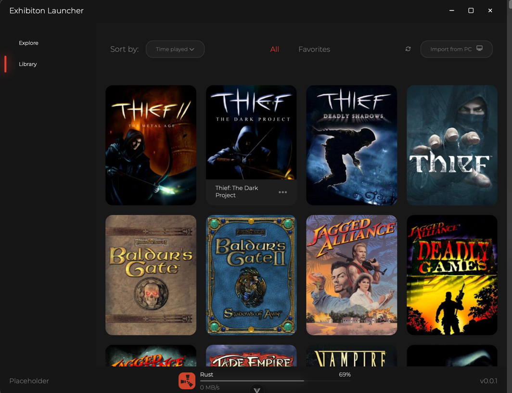

# Exhibition Launcher

A game launcher with built in BitTorrent client. WIP!

# Preview (Development)

## Features

- Import games from pc [✅]
- Metadata from IGDB [✅]
- Real-Debrid support [✅]
- BitTorrent client [🟧]
- Support for download sources[🟧]

## Requirements

- Windows, MacOS or Linux
- Download the [install here](https://github.com/PhoebeEnterprises/exhibition-launcher/releases/)
- IGDB Token

### Tech used

- [Wails 3](https://v3alpha.wails.io/whats-new/)
- [Vue](https://vuejs.org/)
- [IGDB](https://www.igdb.com/)
- [torrent](https://github.com/anacrolix/torrent)