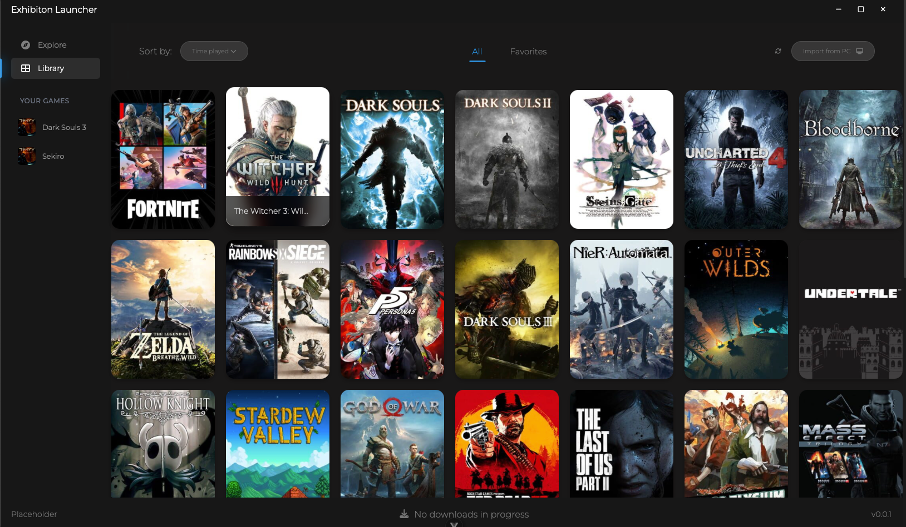
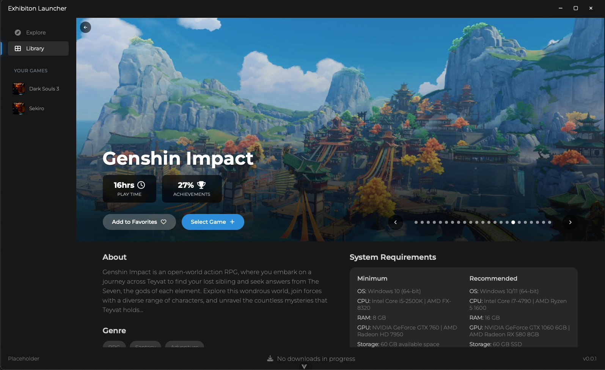

# Exhibition

A game launcher with builtin BitTorrent client. WIP!

# Preview (Development)

## Features

- Import games from pc [WIP]
- Metadata from IGDB [WIP]
- Real-Debrid support [WIP]
- BitTorrent client [WIP]
- Support for download sources [WIP]

## Requirements

- Windows, MacOS or Linux
- Download the [install here](https://github.com/PhoebeEnterprises/exhibition-launcher/releases/)

## Tech used

- [Wails 3](https://v3alpha.wails.io/whats-new/)
- [Vue](https://vuejs.org/)
- [IGDB](https://www.igdb.com/)
- [rain](https://github.com/cenkalti/rain)
- 

## Contributions
This project is public and permissively licensed, but I do not accept contributions or PRs. Fork freely!